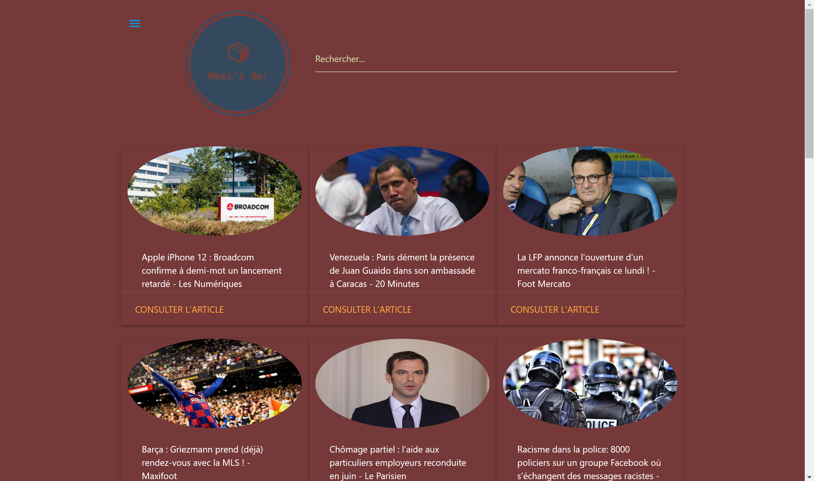
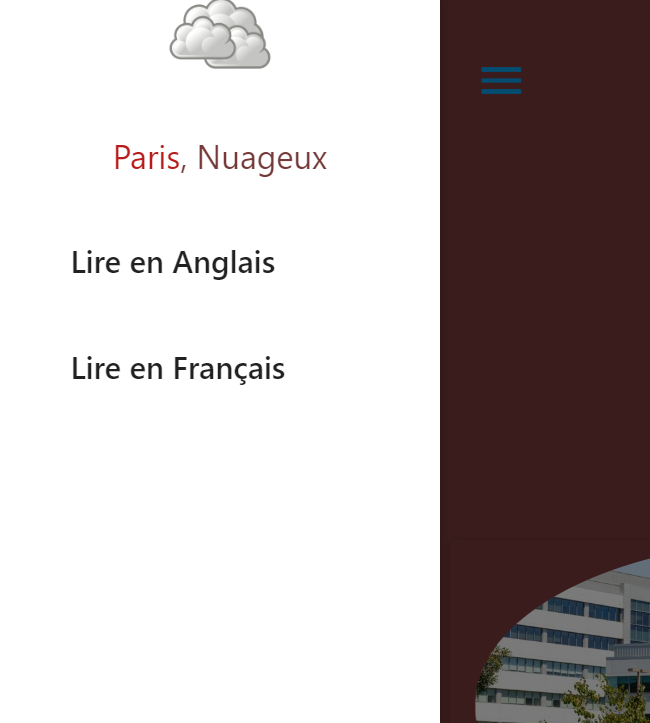

# REFONTE DU SITE
Busted change pour devenir What's Up!
Nouveau design, nouveau logo.  

# Busted
Ceci est un projet qui permet aux utilisateurs de s'informer sur les actualités du moments ainsi que sur les articles liés à un terme recherché.
voici le lien de github pages : https://mouradinan.github.io/Busted/test.html

Notre projet était de créer une application permettant aux RH de pouvoir voir les différents posts d'un candidat à un poste. Nous avons finalement changé de sujet car les apis utilisés ici etais des apis privées necessitant des tokens. Et sans utilisation d'un serveur ce projet etait compliqué. D'où l'importance de l'interopérabilité.
Nous avons donc choisi de faire un mashup liant une API de News ainsi qu'une API de météo. Nous utilisons aussi des APIS d'image pour les drapeaux.
Ce projet a été réalisé par Mourad Inan, Seif Taleb et Anlimou Abdou.

